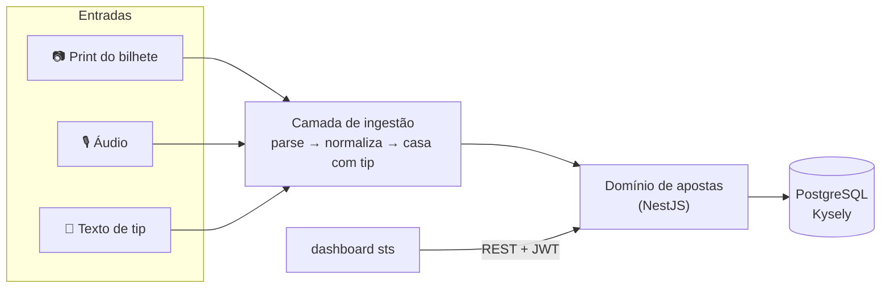
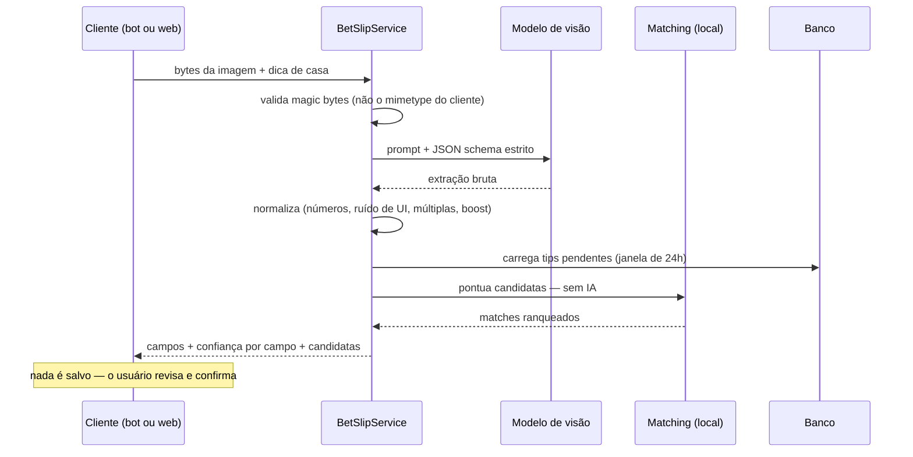

# SportsBet Manager — API

Backend em NestJS para controle de apostas esportivas: banca, saldo por casa, depósitos/saques e análise de desempenho — com uma camada de ingestão multimodal que transforma **um print do bilhete, um áudio ou um texto de tip** numa aposta estruturada.

Frontend companheiro: **[sts](https://github.com/BrunoPerioto1/sts)** (dashboard em React + TypeScript).

---

## O problema

Registrar aposta na mão é a parte que mata o hábito. Uma aposta vive num print da tela de confirmação, numa mensagem de canal de tips, ou naquilo que você resmunga no celular andando na rua. Os três carregam os mesmos cinco fatos — evento, mercado, odd, stake, casa — em formatos completamente diferentes.

Esta API aceita os três e coloca todos no mesmo lugar.



---

## Decisões de engenharia

As partes que valem a leitura do código.

### Nunca confie nos tipos que o modelo devolve

Structured Outputs garante o *formato* do JSON, não a *sanidade* dele. Nada impede um modelo de visão de devolver `"3,00"` num campo numérico, `"Super Odds"` colado no nome do mercado, ou uma aposta em três confrontos diferentes sem um "evento" único.

Por isso a saída do LLM nunca chega direto no domínio: passa por uma camada de normalização pura e testada ([`bet-normalization.ts`](src/bet/bet-normalization.ts)).

| Função | Resolve |
|---|---|
| `normalizeBetNumber` | decimal pt-BR, separador de milhar, prefixo `R$` — desambiguando `1.500` (odd ou dinheiro?) pelo contexto |
| `cleanBetText` | remove ruído de interface (`Criar Aposta`, `Super Odds`, `Cashout`) só como fragmento inteiro entre delimitadores, pra nunca estragar nome de time |
| `foldMultiEventGame` | múltipla de vários jogos não tem um evento: vira `Múltipla (N jogos)` e os confrontos descem pro mercado |
| `capitalizeMarket` | corrige caixa por seleção sem quebrar nome próprio, sigla (`1x2`, `BTTS`) nem linha numérica |

Cada regra aqui existe porque um bilhete real quebrou a anterior. Tudo coberto por teste unitário, **sem nenhuma chamada de rede**.

### Um prompt, três entradas

As regras de extração vivem numa constante só (`BET_EXTRACTION_RULES`), compartilhada pelos caminhos de imagem, áudio e texto. A rota web e o bot usam o **mesmo serviço** — eles não têm como divergir, porque existe um prompt só e um parser só.

### Casamento com tip sem IA

Antes de registrar um bilhete, a API checa se aquilo é uma aposta que o usuário **já recebeu como tip** — senão a mesma aposta entra duas vezes. Essa checagem é de propósito **computação local pura, zero LLM** ([`matching.util.ts`](src/bet-slip/matching.util.ts)):

- **Vetos** (elimina na hora): casa diferente, ou mais de 24h de distância.
- **Score ponderado**: similaridade do confronto `0,30`, mercado `0,20`, odd `0,25`, stake `0,20`, proximidade no tempo `0,05`.
- A odd usa tolerância relativa apertada (a casa mostra o número exato); a stake usa tolerância folgada, porque a stake da tip é estimada por % da banca e pode ter batido no limite.

O score nunca decide sozinho — ele só decide se vale a pena *perguntar* ao usuário.

### Um modelo para cada tarefa

| Tarefa | Modelo | Por quê |
|---|---|---|
| Print → aposta | `gpt-5.6-luna` (visão, Structured Outputs) | precisa ler uma interface poluída e raciocinar sobre quais números importam |
| Áudio → aposta | `gpt-transcribe` → `gpt-5.6-luna` | transcrição e depois o mesmo schema de extração |
| Texto da tip → casa | `openai/gpt-oss-120b` via Groq | volume alto, sensível a latência, estrutura trivial |

Cache de prompt (`prompt_cache_key`) mantém o bloco de regras compartilhado fora da conta a cada requisição.

### Odd com boost

Bilhete turbinado mostra duas odds — a riscada e a final. O parser devolve as duas, com uma checagem de sanidade que descarta uma "original" que não seja estritamente menor que a final. Assim, modelo repetindo o mesmo número nunca vira `4.52 → 4.52` na tela.

---

## Funcionalidades

- **Ciclo da aposta** — criar, editar, excluir e liquidar como Ganha, Perdida, Meio Ganha, Meio Perdida, Cashout (com o valor efetivamente recebido), Cancelada ou Pendente, com lucro calculado por resultado. Liquidação em lote incluída.
- **Casas de apostas** — saldo por casa (depósitos − saques + lucro das apostas) e ranking (ROI, taxa de acerto, odd/stake média).
- **Transações** — depósitos, saques e ajustes manuais, com validação de saldo insuficiente.
- **Dashboard** — resumos diários/mensais e métricas agregadas por período.
- **Ingestão multimodal** — print, áudio ou texto de tip, via Telegram ou pela API web.
- **Detecção de duplicata** — uma impressão digital de usuário + casa + confronto + mercado + odd + stake sinaliza provável duplo registro numa janela de 5 minutos, sem bloquear a inserção.
- **Pipeline de tips** — distribuição de tips para os inscritos, fila de pendências e vínculo aposta↔tip que fecha o ciclo de volta no canal.
- **Enriquecimento de evento** — um coletor agendado do SofaScore preenche o horário real de início do jogo, permitindo agrupar apostas por quando a partida começa e não por quando foram registradas.
- **Vínculo de conta** — fluxo de código de uso único ligando conta do Telegram à conta web.

Autenticação JWT, validação de DTO com `class-validator`/`class-transformer` e documentação OpenAPI gerada.

---

## Stack

**NestJS 11** · TypeScript · **PostgreSQL** via **Kysely** (query builder tipado, não ORM, com conexões separadas de leitura e escrita) · **Passport JWT** + bcrypt · **Telegraf** · **OpenAI SDK** (visão, transcrição, Structured Outputs) · **Groq SDK** · `string-similarity` · **Swagger/Scalar** · deploy como serverless functions na **Vercel**.

---

## Arquitetura

Os módulos seguem controller → service → repository, com as tabelas tipadas pelo Kysely:

```
src/
├── auth/            # login, estratégia JWT, vínculo com Telegram
├── bet/             # CRUD de aposta, liquidação, normalização, matching de evento
├── bet-slip/        # ⭐ ingestão por IA compartilhada: parser, matching, rota parse-image
├── house/           # casas, saldos, ranking
├── transactions/    # depósitos / saques / ajustes
├── dashboard/       # métricas agregadas
├── tips/            # fila e distribuição de tips
├── telegram/        # handlers do bot, callbacks, parsing de texto
├── users/           # perfil do usuário
├── infra/
│   ├── db/          # conexão Kysely
│   └── repository/  # um repositório por agregado
├── db_types/        # tipos das tabelas
└── common/          # decorators e utils compartilhados (cálculo de lucro, datas)
```

`bet-slip/` é deliberadamente livre de Telegram e de HTTP — recebe bytes e um id de usuário, devolve dados estruturados. É isso que permite o bot e a rota web compartilharem o mesmo código.

### Fluxo da leitura do bilhete



A rota de leitura **nunca grava**. Persistir continua sendo do `POST /bets`, que aceita um `tipId` opcional pra vincular a aposta à tip que ela liquida.

---

## Status de resultado

| Status | Lucro |
|---|---|
| Ganha | `stake × (odd − 1)` |
| Perdida | `-stake` |
| Meio Ganha | `(stake / 2) × (odd − 1)` |
| Meio Perdida | `-(stake / 2)` |
| Cashout | `valorCashout − stake` |
| Cancelada | `0` |
| Pendente | `0` (aguardando liquidação) |

---

## Referência da API

A maioria dos endpoints exige um JWT `Bearer`.

| Recurso | Endpoints |
|---|---|
| Auth | `POST /auth/login`, `POST /auth/link-telegram`, `POST /auth/link-telegram/confirm` |
| Usuários | `POST /users`, `GET /users/me`, `PATCH /users/me`, `DELETE /users/me/telegram` |
| Apostas | `POST /bets`, `GET /bets`, `PUT /bets/:id`, `PUT /bets/finalize/:id`, `PUT /bets/finalize-multiple`, `DELETE /bets/:id`, `DELETE /bets/delete-multiple`, `GET /bets/result-types` |
| Leitura de bilhete | `POST /bets/parse-image` — multipart (`image`, `houseHint` opcional); devolve campos + confiança + candidatas a vínculo, **não salva nada** |
| Casas | `GET /house/all`, `GET /house/balances`, `GET /house/metrics`, `GET /house/ranking`, `GET /house/:id`, `POST /house` |
| Transações | `POST /transactions/new`, `GET /transactions/all`, `GET /transactions/types` |
| Dashboard | `GET /dashboard/metrics`, `GET /dashboard/daily-summary`, `GET /dashboard/monthly-summary`, `GET /dashboard/date-range` |
| Tips | `GET /tips`, rotas da fila e de descarte |
| Webhook Telegram | `POST /telegram/:token` |

Documentação interativa em `/api`.

---

## Rodando localmente

**Pré-requisitos** — Node.js 18+, um PostgreSQL e (para ingestão) uma chave da OpenAI. Token de bot do Telegram e chave Groq só são necessários para o bot.

```bash
npm install
cp env.example .env   # preencha os valores abaixo
npm run start:dev     # http://localhost:4000
```

| Variável | Descrição |
|---|---|
| `DB_HOST`, `DB_PORT`, `DB_USER`, `DB_PASSWORD`, `DB_NAME` | conexão com o PostgreSQL |
| `JWT_SECRET` | segredo de assinatura dos tokens |
| `OPENAI_API_KEY` | visão + transcrição (bilhete e áudio) |
| `GROQ_API_KEY` | parsing de texto de tip e resolução de casa |
| `TELEGRAM_BOT_TOKEN` | token do bot, via [@BotFather](https://t.me/BotFather) |
| `APP_URL` | URL pública usada para registrar o webhook do Telegram |
| `API_URL` | URL base que o bot usa para chamar de volta esta API |

O schema (tabelas e seeds) fica em `src/infra/db/schema.sql`.

```bash
npm run start:dev   # dev com hot reload
npm run build       # compila
npm run test        # testes unitários — sem rede, sem chave de API
npm run lint        # lint
```

### Sobre os testes

A suíte cobre normalização, matching, cálculo de lucro e os caminhos completos dos handlers do bot com **toda chamada externa mockada** — sem OpenAI, sem Groq, sem Telegram, sem banco. É deliberado: a parte frágil deste sistema são as regras de parsing, e regra merece teste que roda em segundos e não custa nada.

---

## Documentação adicional

- [`docs/bet-ingestion.md`](docs/bet-ingestion.md) — pipeline de ingestão em detalhe
- [`docs/telegram-audio.md`](docs/telegram-audio.md) — fluxo de áudio
- [`docs/telegram-operations.md`](docs/telegram-operations.md) — registro de webhook e formato dos logs
- [`docs/event-dates.md`](docs/event-dates.md) — enriquecimento de evento via SofaScore

---

## Status

Projeto pessoal, em desenvolvimento ativo. Não endurecido para uso de terceiros — publicado como peça de portfólio.
