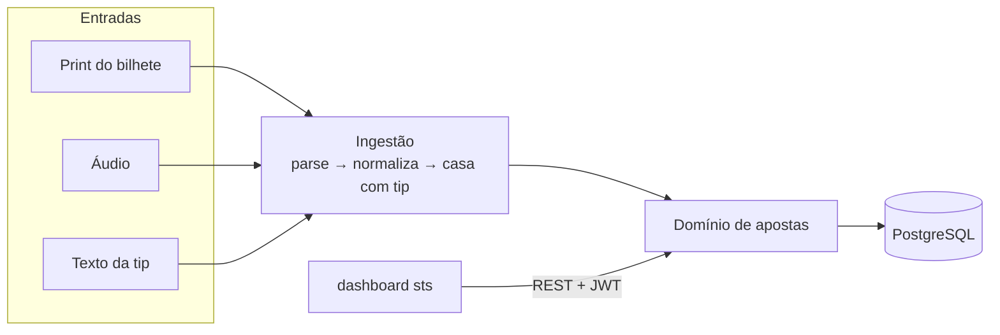
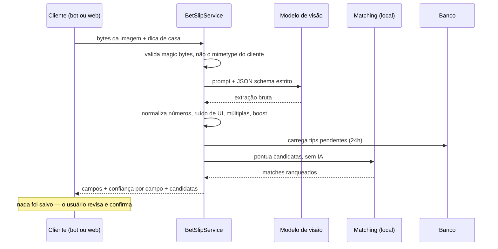

# SportsBet Manager — API

Backend em NestJS que controla apostas esportivas: banca, saldo por casa, depósitos, saques e análise de desempenho. A parte que dá gosto de mostrar é a ingestão: você manda o print do bilhete, um áudio ou o texto da tip, e vira aposta estruturada no banco.

Frontend companheiro: **[sts](https://github.com/BrunoPerioto1/sts)**.

---

## Por que isso existe

Eu registrava aposta em planilha e sempre parava depois de duas semanas. O problema nunca foi o controle em si, foi a digitação: a aposta está num print da tela de confirmação, ou numa mensagem que o tipster mandou no Telegram, ou na minha cabeça enquanto ando na rua. Copiar cinco campos disso na mão, várias vezes por dia, é o suficiente pra desistir.

Então a API aceita as três formas e joga todas no mesmo domínio.



---

## As partes que deram trabalho

### A saída do modelo mente sobre os tipos

Structured Outputs garante o formato do JSON. Não garante que faça sentido. Já recebi `"3,00"` num campo declarado como número, `"Super Odds"` colado no nome do mercado, e bilhete com três confrontos diferentes onde simplesmente não existe "o evento" da aposta.

Por isso nada do modelo chega direto no domínio. Passa antes por [`bet-normalization.ts`](src/bet/bet-normalization.ts), que é código puro e chato:

`normalizeBetNumber` resolve decimal brasileiro, separador de milhar e prefixo `R$`. O caso difícil é `1.500`: isso é odd de três casas ou mil e quinhentos reais? Depende do contexto, e a função decide pelo `R$` e pela quantidade de grupos.

`cleanBetText` tira o lixo de interface — `Criar Aposta`, `Cashout`, `Super Odds`. O truque é remover só fragmento inteiro entre delimitadores, senão você começa a mutilar nome de time.

`foldMultiEventGame` lida com múltipla de jogos diferentes, onde não existe um evento único. Vira `Múltipla (N jogos)` e os confrontos descem pro mercado.

`capitalizeMarket` arruma a caixa por seleção sem quebrar nome próprio, sigla tipo `1x2` e `BTTS`, ou linha numérica.

Cada uma dessas regras existe porque um bilhete real quebrou a versão anterior. Tudo tem teste, e nenhum teste chama a rede.

### Um prompt só, três entradas

As regras de extração vivem numa constante única, `BET_EXTRACTION_RULES`, usada pelos caminhos de imagem, áudio e texto. Quando construí a leitura de bilhete no app web, a tentação era copiar o prompt e adaptar. Não copiei: a rota web e o bot chamam o **mesmo serviço**. Eles não conseguem divergir porque existe um prompt e um parser, ponto.

O `bet-slip/` foi feito sem saber o que é Telegram e sem saber o que é HTTP. Ele recebe bytes e um id de usuário, devolve dados. É isso que permitiu o reuso sem gambiarra.

### O matching não usa IA de propósito

Antes de registrar um bilhete, a API checa se aquilo já chegou antes como tip — senão a mesma aposta entra duas vezes. Dava pra jogar isso num LLM. Não joguei, porque é comparação de números e strings, e LLM aqui só adicionaria latência, custo e não-determinismo.

O [`matching.util.ts`](src/bet-slip/matching.util.ts) tem dois vetos que eliminam na hora: casa diferente, ou mais de 24h de distância. O resto é score ponderado — confronto `0,30`, mercado `0,20`, odd `0,25`, stake `0,20`, proximidade no tempo `0,05`.

A odd tem tolerância apertada porque a casa mostra o número exato. A stake tem tolerância folgada porque a stake da tip é derivada de uma porcentagem da banca e pode ter batido num limite. Detalhe que só aparece usando.

E o score nunca decide sozinho. Ele decide se vale a pena *perguntar*.

### Modelo diferente pra tarefa diferente

| Tarefa | Modelo | Motivo |
|---|---|---|
| Print → aposta | `gpt-5.6-luna` (visão, Structured Outputs) | precisa ler interface poluída e decidir quais números importam |
| Áudio → aposta | `gpt-transcribe` → `gpt-5.6-luna` | transcreve e cai no mesmo schema de extração |
| Texto da tip → casa | `openai/gpt-oss-120b` via Groq | volume alto, sensível a latência, estrutura trivial |

Usar visão pra resolver nome de casa seria desperdício. O cache de prompt (`prompt_cache_key`) mantém o bloco de regras compartilhado fora da conta a cada requisição.

### Bilhete turbinado tem duas odds

Bilhete com boost mostra a odd riscada e a final. O parser devolve as duas, com uma checagem que descarta uma "original" que não seja estritamente menor que a final. Sem isso, modelo repetindo o mesmo número renderiza `4.52 → 4.52` na tela, que é pior que não mostrar nada.

### O coletor que não coube em lugar nenhum

As apostas precisam do horário real de início do jogo pra serem agrupadas por partida, e não pela hora em que foram registradas. Escrevi um coletor em Python que puxa os próximos 30 dias do SofaScore.

Ele não roda na Vercel: o plano Hobby tem teto de 60s por função e um cron por dia, e o coletor precisa do fingerprint TLS do `wreq` pra passar pelo Cloudflare.

Também não roda em runner hospedado do GitHub. O fingerprint resolve o "parece um browser", mas o Cloudflare também pontua reputação de IP, e as faixas do GitHub (Azure) tomam 403 em todo request.

Acabou num **self-hosted runner**, que é o único lugar com IP residencial. Roda segunda e quinta, 11h BRT — horário de máquina ligada, porque execução agendada com runner offline fica na fila. O raciocínio inteiro está comentado no [workflow](.github/workflows/sofascore.yml).

---

## O que o sistema faz

**Apostas.** Criar, editar, excluir e liquidar como Ganha, Perdida, Meio Ganha, Meio Perdida, Cashout (pedindo o valor recebido), Cancelada ou Pendente, com o lucro calculado por resultado. Liquidação em lote pra quando o dia fecha várias de uma vez.

**Casas.** Saldo por casa, que é depósitos menos saques mais lucro das apostas. E um ranking por ROI, taxa de acerto e odd/stake média, que é como se descobre onde você realmente ganha dinheiro.

**Transações.** Depósitos, saques e ajustes manuais, com validação de saldo insuficiente no saque.

**Dashboard.** Resumo diário e mensal, métricas agregadas por período, e comparação entre períodos.

**Ingestão.** Print, áudio ou texto, via bot do Telegram ou pela API web.

**Duplicata.** Uma impressão digital de usuário, casa, confronto, mercado, odd e stake sinaliza provável registro duplo numa janela de 5 minutos. Sinaliza, não bloqueia — às vezes você aposta duas vezes igual de propósito.

**Tips.** Distribuição das tips para os inscritos filtrando pelo percentual mínimo de cada um, fila de pendências, descarte, e o vínculo aposta↔tip que fecha o ciclo de volta no canal.

**Conta.** Cadastro, perfil, troca de senha, exclusão de conta, e o fluxo de código de uso único que liga a conta do Telegram à conta web.

Autenticação JWT, validação de DTO com `class-validator`, e OpenAPI gerado.

---

## Stack

NestJS 11 em TypeScript. PostgreSQL acessado por **Kysely**, que é query builder tipado e não ORM — escolha deliberada, porque as consultas de dashboard são agregações que eu quero escrever em SQL e não adivinhar o que um ORM vai gerar. Conexões separadas de leitura e escrita.

Passport JWT e bcrypt na autenticação. Telegraf no bot. SDK da OpenAI para visão, transcrição e Structured Outputs; SDK da Groq para o texto. `string-similarity` no fuzzy de nome de casa. Swagger com Scalar na documentação. Deploy como serverless function na Vercel, região `gru1`.

---

## Organização

```
src/
├── auth/            login, estratégia JWT, vínculo com Telegram
├── bet/             CRUD, liquidação, normalização, matching de evento
├── bet-slip/        ingestão por IA compartilhada entre bot e web
├── house/           casas, saldos, ranking
├── transactions/    depósitos, saques, ajustes
├── dashboard/       métricas agregadas
├── tips/            fila e distribuição de tips
├── telegram/        handlers do bot, callbacks, parsing de texto
├── users/           perfil
├── infra/
│   ├── db/          conexão Kysely
│   └── repository/  um repositório por agregado
├── db_types/        tipos das tabelas
└── common/          decorators e utils (cálculo de lucro, datas)

jobs/sofascore/      coletor Python de horários de jogo
docs/                documentação de fluxo e operação
```

### O caminho de um bilhete



A rota de leitura não grava. Quem grava é o `POST /bets`, que aceita um `tipId` opcional pra vincular a aposta à tip que ela liquida. Separar as duas coisas foi de propósito: leitura errada não pode virar registro.

Sobre validar magic bytes em vez do mimetype: o mimetype do multipart é escolhido por quem envia. Um PDF renomeado passa. Os bytes iniciais do arquivo, não.

---

## Cálculo de lucro

| Status | Lucro |
|---|---|
| Ganha | `stake × (odd − 1)` |
| Perdida | `-stake` |
| Meio Ganha | `(stake / 2) × (odd − 1)` |
| Meio Perdida | `-(stake / 2)` |
| Cashout | `valorCashout − stake` |
| Cancelada | `0` |
| Pendente | `0` |

---

## Rotas

Quase tudo exige JWT `Bearer`. Documentação interativa em `/api`.

| Recurso | Endpoints |
|---|---|
| Auth | `POST /auth/login` · `POST /auth/change-password` · `POST /auth/link-telegram` · `POST /auth/link-telegram/confirm` |
| Usuários | `POST /users` · `GET /users/me` · `PATCH /users/me` · `DELETE /users/me` · `DELETE /users/me/telegram` |
| Apostas | `POST /bets` · `GET /bets` · `PUT /bets/:id` · `PUT /bets/finalize/:id` · `PUT /bets/finalize-multiple` · `DELETE /bets/:id` · `DELETE /bets/delete-multiple` · `GET /bets/result-types` |
| Leitura de bilhete | `POST /bets/parse-image` — multipart com `image` e `houseHint` opcional; devolve campos, confiança por campo e candidatas a vínculo. Não salva nada. |
| Casas | `GET /house/all` · `GET /house/balances` · `GET /house/metrics` · `GET /house/ranking` · `GET /house/:id` · `POST /house` |
| Transações | `POST /transactions/new` · `GET /transactions/all` · `GET /transactions/types` |
| Dashboard | `GET /dashboard/metrics` · `GET /dashboard/metrics-comparison` · `GET /dashboard/daily-summary` · `GET /dashboard/monthly-summary` · `GET /dashboard/date-range` |
| Tips | `GET /tips` · `POST /tips/:id/planilhar` · `POST /tips/:id/dismiss` · `DELETE /tips/:id/dismiss` |
| Webhook | `POST /telegram/:token` |

---

## Rodando

Precisa de Node 18+, um PostgreSQL e uma chave da OpenAI para a ingestão. Token de bot e chave Groq só se você quiser o bot rodando.

```bash
npm install
cp env.example .env
npm run start:dev     # http://localhost:4000
```

| Variável | Para quê |
|---|---|
| `DB_HOST`, `DB_PORT`, `DB_USER`, `DB_PASSWORD`, `DB_NAME` | conexão com o Postgres |
| `JWT_SECRET` | assinatura dos tokens |
| `OPENAI_API_KEY` | visão e transcrição |
| `GROQ_API_KEY` | parsing de texto e resolução de casa |
| `TELEGRAM_BOT_TOKEN` | token do [@BotFather](https://t.me/BotFather) |
| `TIPS_GROUP_CHAT_ID` | grupo de onde as tips são lidas |
| `APP_URL` | URL pública, usada pra registrar o webhook |
| `API_URL` | URL que o bot usa pra chamar de volta a API |

O schema com tabelas e seeds está em `src/infra/db/schema.sql`.

```bash
npm run start:dev   # dev com hot reload
npm run build
npm run test        # unitários, sem rede e sem chave de API
npm run lint
```

Sobre os testes: cobrem normalização, matching, cálculo de lucro e os handlers do bot inteiros, com toda chamada externa mockada. Nenhum teste toca OpenAI, Groq, Telegram ou banco. É de propósito — a parte frágil aqui são as regras de parsing, e regra merece teste que roda em segundos e não custa nada.

---

## Documentação

- [`docs/bet-ingestion.md`](docs/bet-ingestion.md) — o pipeline de ingestão em detalhe
- [`docs/telegram-audio.md`](docs/telegram-audio.md) — o fluxo de áudio
- [`docs/telegram-operations.md`](docs/telegram-operations.md) — registro de webhook e formato dos logs
- [`docs/event-dates.md`](docs/event-dates.md) — o coletor do SofaScore

---

## Status

Projeto pessoal, em desenvolvimento ativo. Não é feito pra uso de terceiros, está aqui como portfólio.
