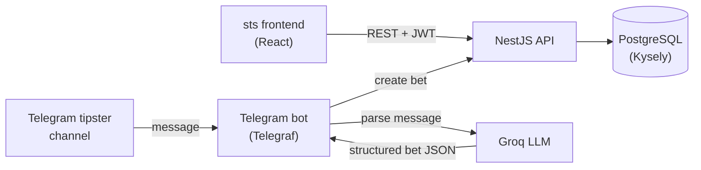
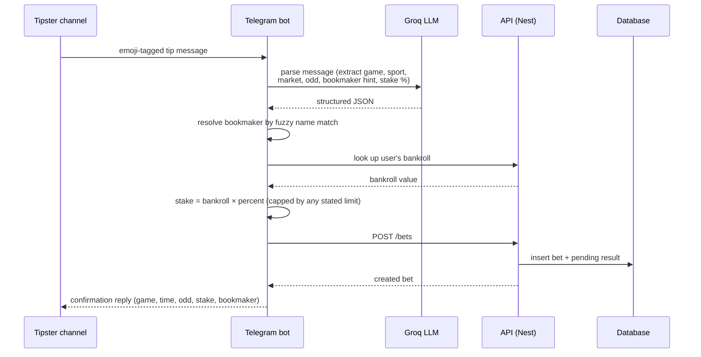

# Betting Tracker — API

A NestJS backend for tracking sports bets: bankroll, bookmaker balances, deposits/withdrawals, and performance analytics — with a Telegram bot that uses an LLM to auto-log bets straight from a tipster channel.

Companion frontend: **sts** (React + TypeScript dashboard) — separate repository.

## Features

- **Bet lifecycle** — create, edit, delete, and settle bets as Won, Lost, Half-Won, Half-Lost, Cashout (with the actual cashed-out amount), Canceled, or Pending, with profit computed automatically for each outcome.
- **Bulk settlement** — resolve many pending bets at once.
- **Bookmaker accounts** — balance per bookmaker (deposits − withdrawals + bet profit), plus a ranking view (ROI, hit rate, average odd/stake) to compare where you actually perform.
- **Financial transactions** — deposits, withdrawals, and manual adjustments per bookmaker, with insufficient-balance validation on withdrawals.
- **Dashboard analytics** — daily/monthly profit summaries and aggregate metrics (ROI, hit rate, average stake/odd) over a date range.
- **Telegram bot** — parses free-text tip messages (an emoji-tagged format posted by a tipster channel) into structured bets using an LLM, resolves the bookmaker by fuzzy name matching, sizes the stake from a percentage of the user's bankroll, and confirms back with the logged details.
- **Account linking** — one-time code flow to link a Telegram account to a web account.
- JWT authentication, request validation via `class-validator`/`class-transformer`, and a generated Swagger/OpenAPI doc.

## Tech stack

- **NestJS 11** (TypeScript)
- **PostgreSQL** via **Kysely** (typed query builder, not an ORM) with separate read/write connections
- **Passport JWT** for auth, **bcrypt** for password hashing
- **Telegraf** for the Telegram bot, **Groq SDK** (LLM) for parsing tip messages
- **class-validator** / **class-transformer** for DTO validation
- **Swagger** (`@nestjs/swagger`) for API docs

## Architecture



The bot and the web frontend are just two entry points into the same bet/bookmaker domain — both end up calling the same services.

Feature modules follow a controller → service → repository layering, with Kysely-typed table interfaces under `src/db_types`:

```
src/
├── auth/            # login, JWT strategy, Telegram account linking
├── bet/              # bet CRUD, settlement, result-status DTOs
├── house/             # bookmakers, balances, ranking
├── transactions/      # deposits / withdrawals / adjustments
├── dashboard/         # aggregate analytics
├── users/             # user profile
├── telegram/           # bot, LLM-based message parsing
├── infra/
│   ├── db/            # Kysely connection setup
│   └── repository/    # one repository per aggregate, Kysely queries
├── db_types/          # Kysely table type definitions
└── common/            # shared decorators, utils (profit calc, date helpers)
```

### Telegram bet-logging flow



## Result statuses

| Status | Profit calculation |
|---|---|
| Won | `stake × (odd − 1)` |
| Lost | `-stake` |
| Half-Won | `(stake / 2) × (odd − 1)` |
| Half-Lost | `-(stake / 2)` |
| Cashout | `cashoutValue − stake` |
| Canceled | `0` |
| Pending | `0` (awaiting settlement) |

## API reference

All endpoints are prefixed with the app's base URL; most require a `Bearer` JWT (see Swagger for the full contract).

| Resource | Endpoints |
|---|---|
| Auth | `POST /auth/login`, `POST /auth/link-telegram`, `POST /auth/link-telegram/confirm` |
| Users | `POST /users`, `GET /users/me`, `PATCH /users/me`, `DELETE /users/me/telegram` |
| Bets | `POST /bets`, `GET /bets`, `PUT /bets/:id`, `PUT /bets/finalize/:id`, `PUT /bets/finalize-multiple`, `DELETE /bets/:id`, `DELETE /bets/delete-multiple`, `GET /bets/result-types` |
| Bookmakers | `GET /house/all`, `GET /house/balances`, `GET /house/metrics`, `GET /house/ranking`, `GET /house/:id`, `POST /house` |
| Transactions | `POST /transactions/new`, `GET /transactions/all`, `GET /transactions/types` |
| Dashboard | `GET /dashboard/metrics`, `GET /dashboard/daily-summary`, `GET /dashboard/monthly-summary`, `GET /dashboard/date-range` |
| Telegram webhook | `POST /telegram/:token` |

Full interactive docs are served at `/api` once the app is running.

## Getting started

### Prerequisites

- Node.js 18+
- A PostgreSQL database
- A Telegram bot token ([@BotFather](https://t.me/BotFather)) and a [Groq](https://groq.com) API key, if you want the bot running

### Setup

```bash
npm install
cp env.example .env   # then fill in the values below
npm run start:dev
```

### Environment variables

| Variable | Description |
|---|---|
| `DB_HOST`, `DB_PORT`, `DB_USER`, `DB_PASSWORD`, `DB_NAME` | PostgreSQL connection |
| `JWT_SECRET` | Signing secret for auth tokens |
| `TELEGRAM_BOT_TOKEN` | Bot token from BotFather |
| `APP_URL` | Public URL this app is reachable at (used to register the Telegram webhook) |
| `API_URL` | Base URL the Telegram bot uses to call back into this API |
| `GROQ_API_KEY` | Groq API key for parsing tip messages |

The database schema (tables, seed data for bookmakers and result statuses) lives in `src/infra/db/schema.sql`.

### Scripts

```bash
npm run start:dev      # dev server with hot reload
npm run build           # compile
npm run start:prod      # run the compiled build
npm run test             # unit tests
npm run test:e2e         # e2e tests
npm run lint              # lint
```

## Status

### Telegram: webhook e duração

O backend não registra o webhook durante a inicialização. Depois do primeiro
deploy, ou ao mudar `APP_URL`/`TELEGRAM_BOT_TOKEN`, configure usando o ambiente
correto e a URL pública já disponível:

```bash
npm run telegram:webhook
```

O webhook já registrado continua válido; não precisa executar a cada deploy
com a mesma URL. Não execute no build de previews, que poderiam redirecionar
o bot de produção. O comando não descarta updates pendentes e não imprime token.

Ao receber foto com legenda, o bot envia “⏳ Analisando a foto…” enquanto
identifica a casa e baixa a imagem em paralelo. O resultado substitui essa
mensagem. Se o aviso falhar, a leitura continua e o resultado é enviado
normalmente.

Logs (todos os valores em milissegundos):

- `[APP_INIT] duration_ms`: criação e inicialização do Nest na instância nova;
  não inclui provisionamento da Vercel nem carregamento anterior dos módulos.
- `[APP_READY] cold_start wait_ms`: espera pela aplicação em cada requisição.
- `[TELEGRAM_WEBHOOK] update_id status duration_ms`: processamento do update,
  incluindo inicialização do Telegraf/getMe quando necessária, até concluir o handler.
- `[BET_IMAGE_FLOW] chat_id message_id mode status feedback_ms house_ms get_file_ms download_ms ai_ms preview_ms total_ms`:
  aviso inicial, consulta de casa, obtenção do link, download dos bytes, leitura
  da IA, envio/edição do resultado e total do fluxo de foto.

Exemplo **ilustrativo**, não medição de produção:

```text
[BET_IMAGE_FLOW] chat_id=1 message_id=10 mode=standard status=ok feedback_ms=180 house_ms=90 get_file_ms=100 download_ms=140 ai_ms=1600 preview_ms=150 total_ms=1990
```

Etapas paralelas não devem ser somadas. Os campos aparecem na ordem em que
cada etapa termina, não na ordem acima. Campos de etapas não executadas são
omitidos. `deep` reaproveita o aviso do botão; seu `total_ms` começa depois
desse aviso. `error`, `invalid_house` e `incomplete` indicam saídas sem preview
válido. Não há medição do upload no celular nem da renderização no aplicativo.

## Status do projeto

Personal project, actively developed. Not production-hardened for third-party use — showcased here as a portfolio piece.
